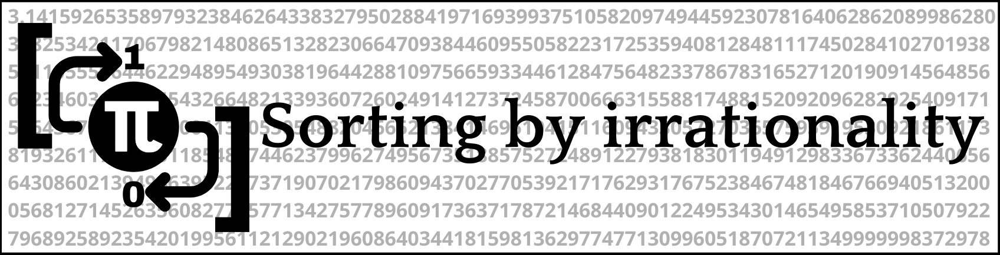
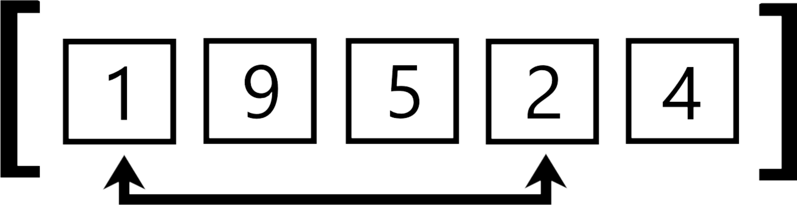

# Irrational-sorting [π]

  
  
  

### Introduction
&ensp;&ensp;&ensp;The Irrational sorting algorithm is an innovative method that uses irrational numbers to organize data. Specifically, it leverages the unique properties of these numbers to exchange and reorganize the data of a list until it's sorted. the idea is perhaps weird or even stupid
but it is **mathematically proven** that it works and that it can be considered as a sorting algorithm because it respects the fundamental laws of sorting algorithms, namely **correctness** and **finiteness**.

## How it works ?
&ensp;&ensp;&ensp;The sorting algorithm sort the items by repeatedly swapping their positions based on the digits of the irrational number used. For example, if the first two digits of the irrational number are 1 and 2, it would swap the first and second items in the list processed. The process continue, using more digits as needed, depending on the size of the list until the list is sort.

<h3>π : 3.1441...<mark><b>03</b></mark></h3>

> [!NOTE]  
>If the decimal points to an index that does not exist. For example the decimal points to index 9 in a list of 6 elements. The exchange is not performed.

## Handling Larger Lists
&ensp;&ensp;&ensp;The algorithm adapts to different list sizes by using more digits from the irrational number as the list grows. For a list of 10 items, you use one digit at a time; for a list of 100 items, you use two digits at a time, and so on. This ensures that every item in the list can be properly sorted, even as the list size increases.

I calculate that with this equation : p = ⌈log10(n)⌉
- p non-zero natural integer
- n non-zero natural integer (a list can't be empty)
  
### Examples :
This for a interval of 1 : [1,4,1,5,9,2,6,5,3,5,8,9,7,...] ← ‘141592653589793238462643383279…’  
And this for a interval of 2 :  [14,15,92,65,35,89,79,...] ← ‘141592653589793238462643383279…’ 

(here it is the first decimals π which are used for the example)

| Tables        | Are           | Cool  |
| ------------- |:-------------:| -----:|
| col 3 is      | right-aligned | $1600 |
| col 2 is      | centered      |   $12 |
| zebra stripes | are neat      |    $1 |
