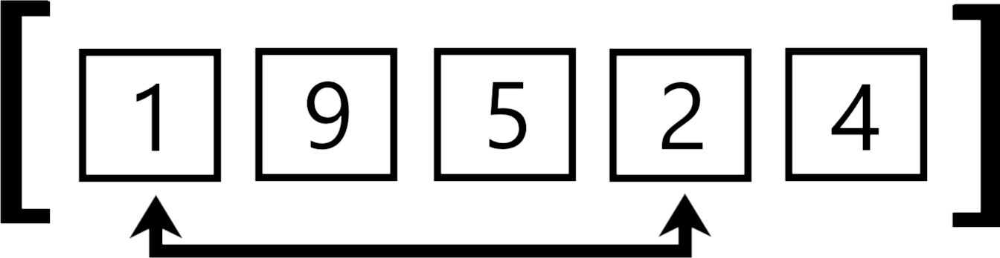

# [π] Irrational-sorting 
<div align="center"></div>

<div align=center>
  
  
  
</div>

## Iπtroductioπ
&nbsp;&nbsp;&nbsp;&nbsp;The Irrational sorting algorithm is an innovative method that uses irrational numbers to organize data. Specifically, it leverages the unique properties of these numbers to exchange and reorganize the data of a list until it's sorted. the idea is perhaps weird or even stupid
but it is **mathematically proven** that it works and that it can be considered as a sorting algorithm because it respects the fundamental laws of sorting algorithms, namely **correction** and **finiteness**.

## Hϕw it wϕrks ?
&nbsp;&nbsp;&nbsp;&nbsp;The sorting algorithm sort the items by repeatedly swapping their positions based on the digits of the irrational number used. For example, if the first two digits of the irrational number are 1 and 2, it would swap the first and second items in the list processed. The process continue, using more digits as needed, depending on the size of the list until the list is sorted.

<div align="center"></div>

<div align="center"><h3>π : 3.1415...<mark><b>03</b></mark></h3></div>

> [!NOTE]  
>If the decimal points to an index that does not exist. For example the decimal points to index 9 in a list of 6 elements. The exchange is not performed.

## Hαndling Lαrger Lists
&nbsp;&nbsp;&nbsp;&nbsp;The algorithm adapts to different list sizes by using more digits from the irrational number as the list grows. For a list of 10 items, you use one digit at a time; for a list of 100 items, you use two digits at a time, and so on. This ensures that every item in the list can be properly sorted, even as the list size increases.

I calculate that with this equation : p = ⌈log<sub>10</sub>(n)⌉
- p ∈ ℕ*  : the interval of decimals to take 
- n ∈ ℕ*  : number of elements on the list

### Examples :
- p = 1 : ‘141592653589793238462643383279…’ → 1,4,1,5,9,2,6,5,3,5,8,9,7,...  
- p = 2 : ‘141592653589793238462643383279…’ → 14,15,92,65,35,89,79,32,38,... 

(here it is the first decimals of π which are used for the example)

## ✅ δemonstration to prove the **correction** and **finiteness**
&nbsp;&nbsp;&nbsp;&nbsp;Proving both correction and finiteness is essential for establishing the reliability and practicality of the irrational sorting algorithm. Without these proofs, there would be no way to ensure that the algorithm could be used effectively in any situation. By carefully leveraging the properties of irrational numbers and probability theory, I successfully demonstrated that my algorithm will always sort a list correctly and will always finish the task in a finite amount of time.

  <div align="center"><h2><strong><mark>Correction</mark></strong></h2></div>

  > [!NOTE]  
  > correction in the context of a sorting algorithm means that the algorithm will always produce a sorted list as output, regardless of the initial order of the elements. This property ensures that the algorithm is reliable and can be trusted to perform the sorting task accurately.
  
  The algorithm makes swaps between items based on the digits of the irrational number. He can do it theoretically infinitely. Plus the algorithm is made in a while loop that will stop if the list is sorted. 
  ```
  while is_sorted(my_list) == False :
      swap element in the list based on the digits
  ```
  So if I prove that the list can be sorted then I can prove the correction, I already said that But proving that is by proving the Finiteness because the Finiteness is by sorting the list. *Understand ?*
  It means that if I prove the Finiteness I prove the correction. It's the same with the bogo sort.
  
  <div align="center"><h2><strong><mark>Finiteness</mark></strong></h2></div>

> [!NOTE]  
> Finiteness refers to the algorithm's ability to complete the sorting process in a finite amount of time. In other words, the algorithm should not run indefinitely; it should eventually stop once the list is sorted.

1. <ins><h3> Valid Swaps: </h3></ins>
- The probability that the one indices randomly drawn in the interval $[0,10^p−1]$ for the swap are in the valid interval $[0,𝑛 − 1]$ is :
  $${n \over 10^p}$$
  But for a swap we need not one but two indices randomly drawn in the interval $[0,10^p−1]$ that are in the valid interval $[0,𝑛 − 1]$. So the correct probability is :
  $${n \over 10^p}\cdot{n \over 10^p}$$ so $${n^2 \over 10^{2p}}$$

> [!TIP]
**Example to understand** : If I take a list of 11 elements then n = 11 and I have an interval of 2 because p = ⌈log<sub>10</sub>(11)⌉ <=> 2, so the possible values ​​go from 0 to 99, 
>This lead to 
>$${11 \over 100}$$​ 
>of having a valid index. And this is also equal to 
>$${11 \over 10^2}$$​ 
>that can be write 
>$${n \over 10^p}$$​ 
>With what I have said before

2. <ins><h3> Well-sorted Swaps: </h3></ins>
- Each valid swap has a probability of 
$${1 \over 2}$$​ 
 of producing a well-ordered pair. 
 To determine this I done a **reasoning by disjunction of cases** :

  There are four possible cases to consider based on the relationships between the elements $a$ and $b$ and their indices $i$ and $j$. Let's analyze these cases.
  Let $a$ be the element at index $i$ and $b$ be the element at index $j$ such as $a = list[i]$ and $b = list[j]$. I Assume that $i$ and $j$ are distinct.
  Here are the four cases to consider:

  1. **Case 1: `a > b ` and `i > j` :**
      Here, $a$ is greater than $b$, and $a$ is at a later position in the list $i > j$.
      **Result**: The swap does not change the correct order (if we want an ascending sort). The elements will still be in the correct order after the swap.

  2. **Case 2: `a > b` and  `j > i` :**
      Here, $a$ is larger than $b$, but $b$ is at a later position in the list $j > i$.
      **Result**: The swap improves the order of the list because, after the swap, $b$ will be in the correct place before $a$.

  3. **Case 3: `b > a` and  `i > j` :**
     Here, $b$ is larger than $a$, but $a$ is at a later position in the list $i > j$.
     **Result**: The swap improves the order of the list because, after the swap, $a$ will be in the correct place before $b$.

  4. **Case 4: `b > a` and `j > i` :**
     Here, $b$ is greater than $a$, and $b$ is at a later position in the list $j > i$.
     **Result**: The swap does not change the correct order (if ascending sorting is desired). The elements will still be in the correct order after the swap.

  #### Case Analysis

  - **Case 1 and Case 4**: The swap does not change the correct order, so it does not directly contribute to the partial sort.
  - **Case 2 and Case 3**: The swap improves the order of the list, thus contributing to the partial sort.

  #### Conclusion
  There are therefore two cases out of four (Case 2 and Case 3) where the exchange improves the order, which gives a probability of 2/4, that is to say **1/2** that the exchange contributes to the partial sorting of the list.

3. <ins><h3> Combined Probability: </h3></ins>
- The combined probability that a valid swap produces a well-ordered pair is 
$${n \over 10^p}\cdot{1 \over 2}$$ so $${n^2 \over 2\cdot10^{2p}}$$

> [!IMPORTANT]
> **Conclusion :** Although the probability of each individual swap bringing the list to a completely sorted state is small, it is not zero. With enough swaps, the cumulative probability of getting a sorted list tends to 1. The non-zero probability of improvement at each swap ensures that the algorithm will not run forever without ever producing a complete order.
> This means that, theoretically, the algorithm will eventually sort the list completely, even though it may take a very large number of swaps.
> Therefore **finiteness** is prouved and so the **correctness** as well.


## 📼 Thε application
&nbsp;&nbsp;&nbsp;&nbsp;If you have remark it, this is not a repository to just a `README.md` but for a whole application. The application is called `Sorting Visualizer` and the title say it all but this is an visualisation of the Irrational sorting !
### Interface
The interface is pretty simple. Their is two slidebar :
- One to select the speed or the sorting (can be change during the sorting)
- Another one to select for the numbers of elements to sort

Then the `start button` to start the sorting and the `restart button` to start another sorting with different parameters. You can even choose your irrational number !

Here a photo to see how it look like :

 
 
 > [!TIP]
  The window is resizable to your liking so take advantage of it :)

### Irrational number available
Plus you can use different irrational number to sort your list : 
| Symbol | Name | 
|:-------------:|:--------------|
| **π** | pi, Archimedes' constant |
| **ϕ** | phi, golden number| 
| **e**| Euler's constant, exponential  | 
| <strong>C<sub>10</sub></strong>| Champernowne constant | 
